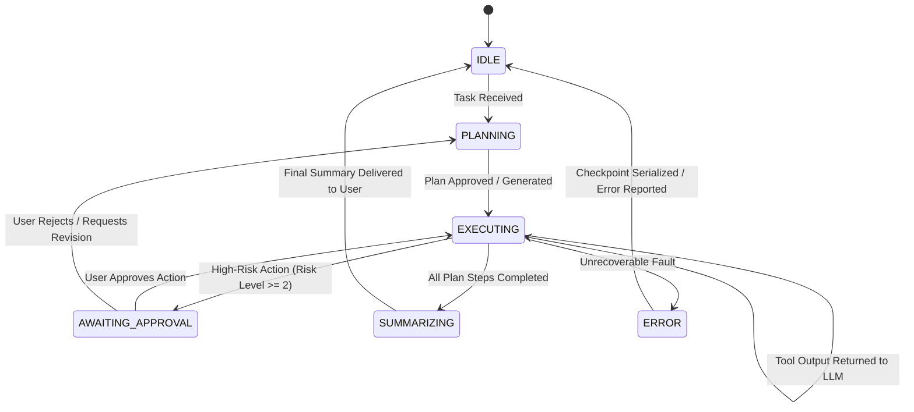

# Core Algorithms & Parsing Engines (Algorithms)

Stellarigent implements resilient algorithms engineered specifically to maintain deterministic behavior when working with 3B - 7B parameter local models that inherently have higher error rates in formatting.

---

## 1. Deterministic Agent State Machine (`src/agent.js`)

The core execution loop (`runAgentLoop`) strictly governs execution state transitions:



---

## 2. 5-Tier Resilient Response & Tool Parser (`src/llm/llmClient.js`)

Smaller models frequently drop quotation marks, generate Markdown wrappers around raw JSON, or insert chatter before/after structured outputs. Stellarigent mitigates this with a robust **5-Tier Parsing Hierarchy**:

1. **Tier 1: Strict JSON Parse:**
   * The raw LLM string is passed directly into `JSON.parse()`. Fast-path execution for high-compliance models.
2. **Tier 2: Markdown Fenced Block Extraction:**
   * Uses regular expressions to extract JSON payloads from ```` ```json ... ``` ```` or ```` ``` ... ``` ```` blocks, trimming extraneous conversational text.
3. **Tier 3: XML / HTML Tag Parsing:**
   * Scans for tool tags such as `<tool_call>`, `<function>`, or `<action>`, extracting attributes and inner JSON payloads.
4. **Tier 4: Regex Bracket Balancing & Syntax Repair:**
   * Locates the first `{` and finds its matching closing `}` by counting nesting levels.
   * Automatically strips trailing commas, escapes raw unescaped newlines/quotes, and repairs truncated syntax.
5. **Tier 5: Natural Language Heuristic Fallback:**
   * If the model entirely refuses to output structured syntax and responds with plain language (e.g., *"I will read file src/agent.js"*), intent analysis transforms this statement into a valid `filesystem_read` tool call.

---

## 3. AMPR: Adaptive Model Performance Router (`src/llm/performanceTracker.js`)

Stellarigent actively measures the execution latency and tool-calling success rates of local models using an Exponentially Weighted Moving Average (EWMA):

### EWMA Latency Formulation
To smooth out transient CPU/GPU spikes, latency is computed as:

$$S_t = \alpha \cdot Y_t + (1 - \alpha) \cdot S_{t-1}$$

* $\alpha = 0.2$ (Weight assigned to the most recent measurement)
* $Y_t$: Measured tool latency of the current call (in milliseconds)
* $S_{t-1}$: Previous smoothed moving average

If a model repeatedly encounters timeouts or Tier 4/5 parsing fallbacks, its health score decays, prompting `modelManager.js` to automatically fall back to the next candidate model defined in the Fallback Ladder.

---

## 4. Atomic Checkpointing & Disaster Recovery (`src/checkpoint.js`)

Protects long-running multi-step tasks against system crashes, power loss, or sudden browser terminations:
* **Atomic Disk Flush:** Writes the serialized state to a temporary file (`.tmp`) and executes `fs.renameSync` to replace the target checkpoint file atomically, preventing partial/corrupt disk writes.
* **24-Hour TTL:** Checkpoints older than 24 hours are automatically purged to prevent disk clutter.
