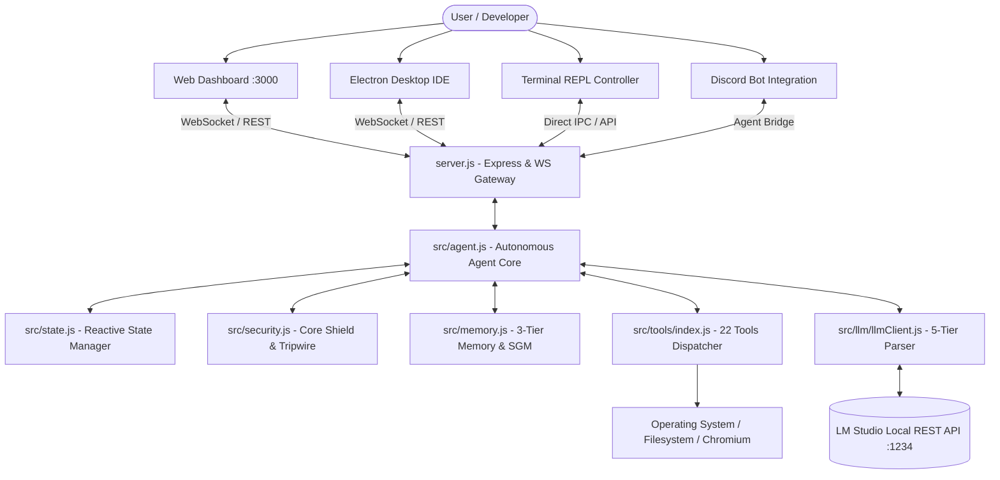

# System Architecture & Transport Layers (Architecture)

Stellarigent is built around a decoupled, reactive, multi-channel (omnichannel) software architecture. The core agentic loop operates independently from frontend user interfaces and the underlying LLM inference server.

---

## High-Level Architecture Diagram

---

## 1. Multi-Channel Transport Layers

Stellarigent supports concurrent interaction across four distinct communication interfaces:

### A. Modern Web Dashboard (`public/`)
* **Technology:** Vanilla HTML5, CSS3, modern modular JavaScript, native WebSocket client.
* **Capabilities:** 
  * Real-time streaming of model reasoning, tool invocations, and live system metrics.
  * Two-pane reactive layout (Left: Conversation history & agent log; Right: Live state monitor & Approval Drawer).
  * Consolidated 6-panel Advanced Settings Hub (Model Router, Guide Editor, Prompt Manager, Budget Limiter, Security Rules).

### B. Electron Desktop IDE (`electron/`)
* **Technology:** Electron runtime, integrated Monaco Code Editor (VS Code core), dynamic port synchronizer.
* **Capabilities:** Standalone desktop IDE with a local workspace file tree, code viewer/editor, automatic background server initialization (`main.js`), and agent task progress bar.

### C. Terminal REPL Controller (`src/cli/terminalController.js`)
* **Technology:** Node.js Readline API, ANSI terminal color formatting.
* **Capabilities:** Lightweight, headless command-line operation without launching a browser; colorized approval prompts, and interactive commands (`/switch`, `/status`, `/budget`, `/help`).

### D. Discord Bot Integration (`src/discord/`)
* **Technology:** Discord.js v14, `@discordjs/voice`, `yt-dlp`.
* **Capabilities:** Remote mobile delegation (`!ask <prompt>`), interactive Discord action buttons for Human-in-the-Loop approvals/rejections (`agentBridge.js`), and voice channel streaming (`musicPlayer.js`).

---

## 2. Central Server Gateway (`server.js`)

* **Express REST Endpoints:**
  * `/api/health`: Provides real-time CPU, RAM, process uptime, and security tripwire status.
  * `/api/setup`: Manages the initial first-run onboarding wizard.
  * `/api/tripwire/reset`: Secure endpoint for human-authorized reset of tripped security alarms.
* **WebSocket Engine (`src/ws/wsHandler.js`):**
  * Employs a 150ms debounced delta-diff broadcasting mechanism (`state_patch`) to minimize WebSocket traffic.
  * Supports seamless resumption of interrupted tasks via cached atomic checkpoints.

---

## 3. Docker Containerization (`Dockerfile` & `docker-compose.yml`)

For hardened isolation from the host operating system:
* **Base Image:** `node:20-bullseye-slim`
* **Preinstalled Dependencies:** Headless Chromium (for Puppeteer automation), Git, curl, procps.
* **Sandbox Confinement:** Restricts file write and shell execution privileges strictly to `.container/scratch` and designated volume mounts.
