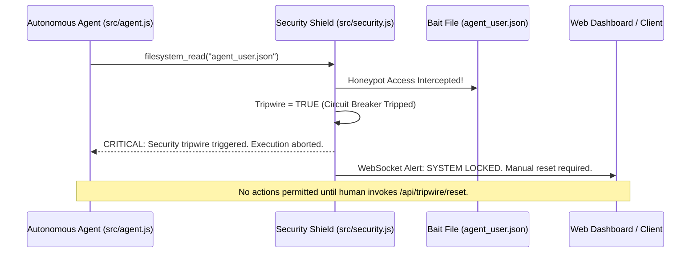

# Security, Isolation & Honeypot Tripwire Circuit Breaker

Stellarigent incorporates a hardened, multi-tier security framework (`src/security.js`) designed to prevent autonomous local models from damaging operating system integrity, corrupting core codebases, or leaking confidential credentials.

---

## 9-Layer Defense-in-Depth Architecture

1. **Layer 1: Read-Only Core Shield:**
   * Protects fundamental agent runtime files (`server.js`, `src/agent.js`, `src/security.js`, `package.json`). The agent is categorically blocked from altering or deleting its own execution engine.
2. **Layer 2: Banned Command & Word Regex Filter (`config/security_rules.json`):**
   * Destructive commands such as `format`, `rm -rf /`, `del /f /s /q C:\Windows`, `drop database`, or `mkfs` are intercepted and blocked at the regex boundary.
3. **Layer 3: Sanitized Subprocess Environment:**
   * When invoking `system_execute_command`, local `.env` values (Discord bot tokens, personal API keys, passwords) are scrubbed from the spawned shell process environment.
4. **Layer 4: Honeypot Tripwire Bait (`agent_user.json`):**
   * A synthetic bait file (`agent_user.json`) sits at the repository root. If the model attempts to read or mutate this file due to a prompt injection attack or runaway hallucination, the **Tripwire Circuit Breaker** trips instantly.
5. **Layer 5: Emergency Execution Quarantine:**
   * Once tripped, the active agent loop freezes immediately, all running subprocesses are terminated (`SIGKILL`), and the dashboard enters high-alert lockdown.
6. **Layer 6: Explicit Human Reset:**
   * A quarantined system can only be unlocked through a deliberate human action via the `/api/tripwire/reset` endpoint.
7. **Layer 7: Web Scraping Sanitizer (`src/security/webSanitizer.js`):**
   * Strips invisible CSS styling, hidden DOM elements, and zero-width characters from scraped HTML to neutralize indirect prompt injection payloads.
8. **Layer 8: Token Budget Circuit Breaker (`src/llm/costTracker.js`):**
   * Tracks daily API spend. If cloud fallbacks exceed the configured threshold (e.g. `$1.00 USD/day`), cloud requests are halted automatically.
9. **Layer 9: Docker Container Isolation:**
   * Complete OS-level container isolation through the bundled `Dockerfile` and `docker-compose.yml`.

---

## Honeypot & Tripwire Execution Flow

