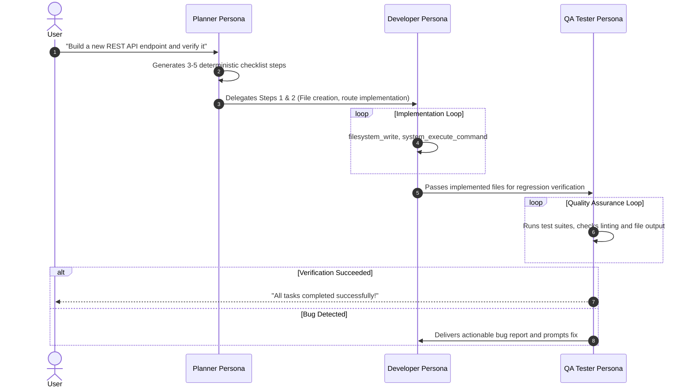

# End-to-End Operational Workflows (Workflows)

Stellarigent dynamically coordinates diverse execution workflows, scaling from single-command utility queries up to multi-step autonomous software engineering operations.

---

## 1. Multi-Agent Swarm Mode

For intricate development tasks, the engine dynamically decomposes the prompt into specialized virtual personas:

---

## 2. Human-in-the-Loop Approval Workflow

Whenever a tool with Risk Level 2 is called, execution halts and awaits explicit confirmation:
1. **Web Dashboard:** The right-hand **Approval Drawer** slides open automatically, displaying exact diffs, command strings, and potential risk warnings.
2. **Terminal (CLI):** Highlights an interactive ANSI prompt (`[Y] Approve / [N] Deny / [E] Edit arguments`).
3. **Discord:** Delivers an interactive embed card with colorized green/red action buttons.

---

## 3. Direct Manual Tool Mode (Manuel Tools)

When you simply need to perform a one-off utility action (e.g. scrape a specific URL or extract text from a PDF):
* Bypasses the multi-step planning loop entirely.
* Executes the requested tool in a single, fast invocation and returns the result immediately.
